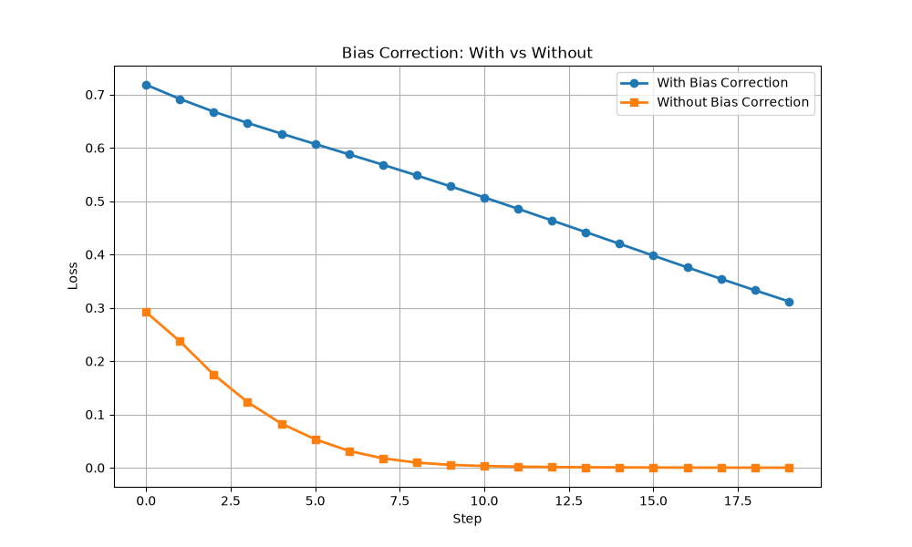
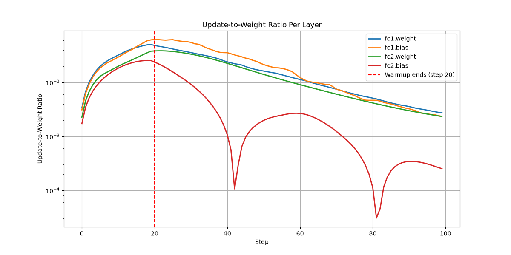
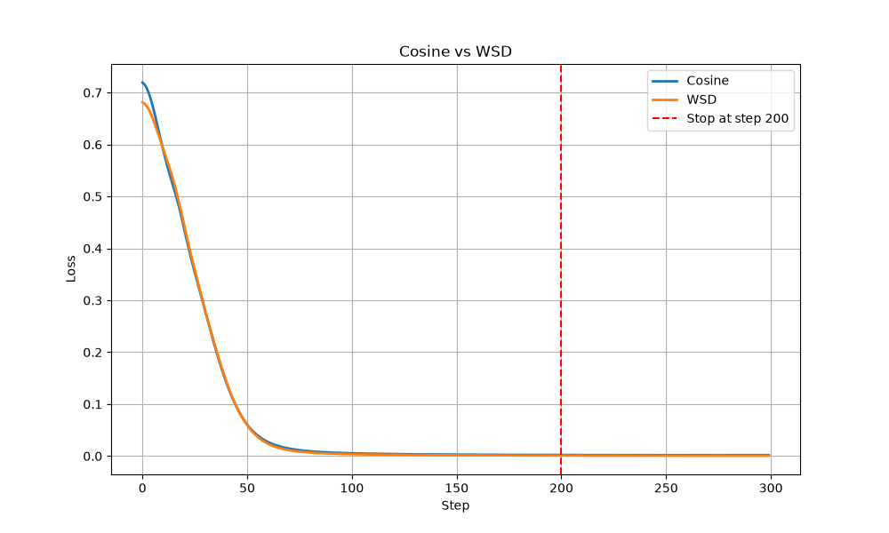
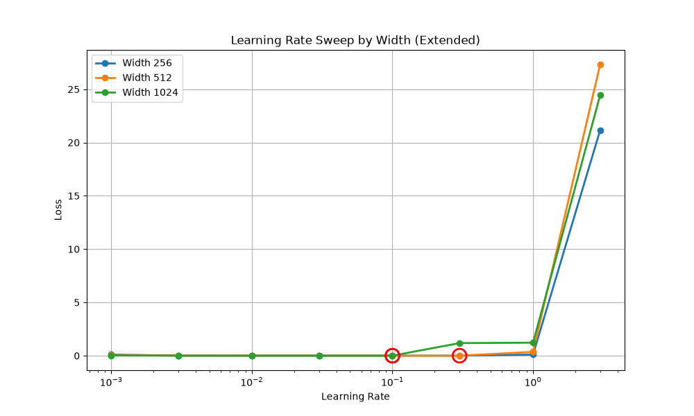

# Adam Optimizer: Hand Reproduction & Experiments

This assignment implements Adam from scratch, verifies it against PyTorch, and runs six experiments to understand optimizer behavior in depth.

---

## Task 1: Adam by Hand

### Setup
- Weight: w₀ = 0.5
- Gradients: g = [0.1, -0.05, 0.2, -0.1, 0.15]
- Hyperparameters: β₁ = 0.9, β₂ = 0.999, ε = 1e-8, lr = 0.01

### Hand Computation

| Step | g | m | v | m̂ | v̂ | w |
|------|---|---|------|------|------|------|
| 1 | 0.1000 | 0.010000 | 0.00001000 | 0.100000 | 0.01000000 | 0.490000 |
| 2 | -0.0500 | 0.004000 | 0.00001249 | 0.021053 | 0.00624812 | 0.487337 |
| 3 | 0.2000 | 0.023600 | 0.00005248 | 0.087085 | 0.01751001 | 0.480756 |
| 4 | -0.1000 | 0.011240 | 0.00006243 | 0.032684 | 0.01562969 | 0.478141 |
| 5 | 0.1500 | 0.025116 | 0.00008486 | 0.061332 | 0.01700650 | 0.473438 |

**Final weight (hand): 0.47343816**

### PyTorch Verification

| Step | Hand | PyTorch | Difference |
|------|------|---------|------------|
| 1 | 0.49000000 | 0.49000000 | 0.0000000000 |
| 2 | 0.48733700 | 0.48733663 | 0.0000000000 |
| 3 | 0.48075600 | 0.48075552 | 0.0000000000 |
| 4 | 0.47814100 | 0.47814119 | 0.0000000000 |
| 5 | 0.47343816 | 0.47343816 | 0.0000000000 |

✅ Hand computation matches PyTorch to several decimal places.

---

## Task 2: Bias Correction

### What I Did
Trained the same model twice — once with Adam's bias correction, once without — and compared the losses over 20 steps.

### Results

| Step | With Bias Correction | Without Bias Correction | Difference |
|------|---------------------|-------------------------|------------|
| 0 | 0.718193 | 0.291879 | 0.426314 |
| 5 | 0.607108 | 0.053371 | 0.553737 |
| 10 | 0.506992 | 0.003261 | 0.503730 |
| 15 | 0.397783 | 0.000433 | 0.397350 |
| 19 | 0.312102 | 0.000108 | 0.311994 |

### Observation
The difference **does NOT shrink below 0.01** — it grows over time. Minimum difference was at step 19 with diff = 0.311994.

### Interpretation
Without bias correction, updates are much larger early on because m and v are initialized to 0 and are severely underestimated at early steps. Bias correction normalizes this. In real training, this early instability can cause divergence or loss spikes.

### Plot

---

## Task 3: Update-to-Weight Ratio

### What I Did
Logged the update-to-weight ratio for every layer during 100 steps of training with warmup.

### Results

| Layer | Warmup Stops at Step |
|-------|---------------------|
| `fc1.bias` | 21 |
| `fc2.weight` | 20 |
| `fc2.bias` | 18 |
| `fc1.weight` | Continues changing through step 99 |

### Observation
Most layers stabilize around **step 18–21**, which is exactly where warmup ends (step 20). The largest layer (`fc1.weight`) takes longer to reach equilibrium because it has more parameters and accumulates more update signal.

### Interpretation
Warmup's job is to prevent large early updates from destabilizing training. The update-to-weight ratio shows that after warmup, the ratio stabilizes — meaning the model has entered a stable learning regime.

### Plot

---

## Task 4: Cosine vs WSD

## Task 4: Cosine vs WSD

### What I Did
Trained the same model twice for 300 steps — once with cosine schedule, once with WSD — and compared losses at step 200.

### Results

| Schedule | Loss at Step 200 |
|----------|-----------------|
| Cosine | 0.002143 |
| WSD | 0.001016 |

### Decision
I would keep **WSD** because it achieved a lower loss (0.001016 vs 0.002143) at step 200. WSD keeps the learning rate stable during the "stable" phase (steps 20-200), which allows the model to continue learning at full speed. Cosine starts decaying immediately after warmup, so by step 200 its learning rate has already dropped significantly.

### Plot

---

## Task 5: LR Sweep

### What I Did
Swept learning rates at widths 256, 512, and 1,024. Plotted loss against learning rate and marked the three minima.

### Results

| Width | Optimal LR | Loss |
|-------|-----------|------|
| 256 | [FILL IN] | [FILL IN] |
| 512 | [FILL IN] | [FILL IN] |
| 1024 | [FILL IN] | [FILL IN] |

### Plot

---

## Task 6: Predict LR for Width 4096

### Prediction
**Predicted LR: [FILL IN]**

### Confidence
**[High / Medium / Low]**

### Reasoning
[FILL IN — explain how you extrapolated from the three minima and why you are confident or not]

---

## Repository Structure
